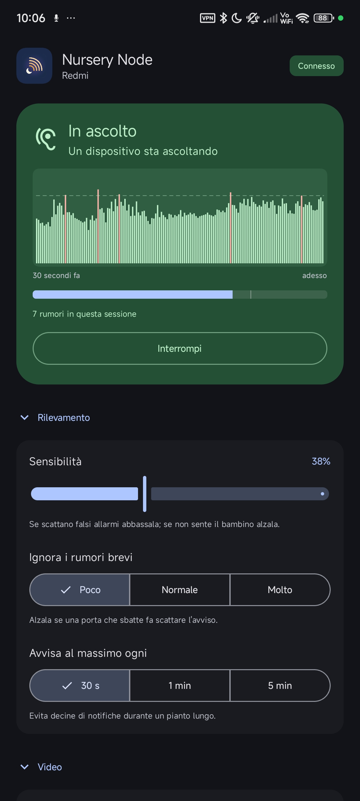
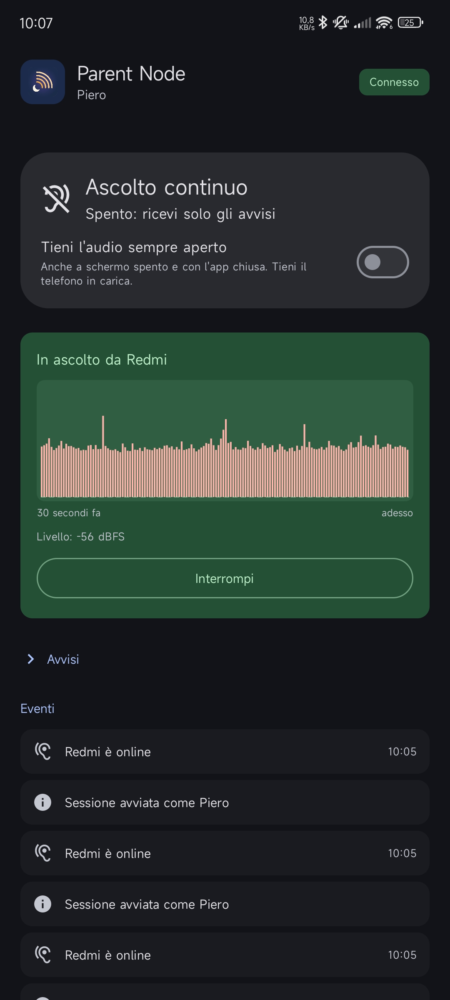

<p align="center">
  <picture>
    <source media="(prefers-color-scheme: dark)" srcset="packaging/banner-dark.svg">
    
  </picture>
</p>

<p align="center">
  A <strong>self-hosted baby monitor</strong> for Android.<br>
  A phone in the nursery detects crying and alerts the parents' phones in seconds; audio and video
  stream <strong>peer-to-peer</strong> across your own private
  <strong>Tailscale</strong> network — at home on the sofa, or from anywhere else.<br>
  No cloud, no subscription, no account.
</p>

<p align="center">
  <a href="https://github.com/Piero-93/CryLog/actions/workflows/ci.yml"></a>
  <a href="https://github.com/Piero-93/CryLog/releases/latest"></a>
  
  
  
</p>

Commercial baby monitor apps route your child's audio and video through servers you do not control.
CryLog does not: the media goes straight from one phone to the other, and the only thing you run is
a small Node.js service on your own hardware — one dependency, a few hundred lines, a SQLite file
you can read with `sqlite3`.

> **Status.** All nine planned phases are implemented; the current release is **v0.1.0**. Noise
> alerts, push notifications, WebRTC audio and video, talk-back, continuous listening, streaming
> from outside the house over the tailnet, and up to three Parent Nodes at once are in the app
> today. The Hub ships as a container image, the app as a signed APK attached to each release.

---

## Contents

- [Features](#features)
- [Screenshots](#screenshots)
- [Terminology](#terminology)
- [Know this before you start](#know-this-before-you-start)
- [Three things that will bite you](#three-things-that-will-bite-you)
- [Requirements](#requirements)
- [Another network instead of Tailscale](#another-network-instead-of-tailscale)
- [Quick start](#quick-start)
- [Installation](#installation)
- [Configuration](#configuration)
- [Hub API](#hub-api)
- [Privacy](#privacy)
- [Troubleshooting](#troubleshooting)
- [Design notes](#design-notes)
- [Roadmap](#roadmap)
- [Known limitations](#known-limitations)
- [Contributing](#contributing)
- [Disclaimer](#disclaimer)
- [License](#license)

---

## Features

- **Noise alerts that work independently of streaming.** The Nursery Node monitors audio in a
  dedicated foreground service. Alerts fire whether or not anyone is watching a stream — a monitor
  that only warns you while you happen to be looking at it is not a monitor.
- **On-demand audio and video** over WebRTC, peer-to-peer, with adaptive bitrate. The Hub brokers
  the connection and then gets out of the way: offer, answer and ICE candidates are opaque to it.
- **Continuous listening**, opt-in: the audio stays open all night with the screen off.
- **Up to three Parent Nodes at once**, each choosing audio, or audio and video, for itself. The
  nursery's microphone and camera are opened once and shared between them.
- **Never an ambiguous silence.** If a stream dies, the Parent Node retries and then raises an
  audible alarm. If the Nursery Node stops answering, the Hub tells every Parent Node — with the
  reason, `disconnected` or `timeout`.
- **Push notifications** so an alert reaches a phone whose app is closed and whose screen is off.
  Optional, and the only place CryLog touches a third party.
- **Video is always optional**, at two independent levels: globally on the Nursery Node
  ("audio only"), and per-connection on each Parent Node.
- **Talk-back** from a Parent Node to the nursery.
- **Role changes without re-pairing.** A phone that was the nursery last week can be a parent
  tonight, from its own screen.
- **Event history**: timestamp, duration and peak level of every noise event. **No audio is ever
  stored** — there is no code path that writes a sample to disk.
- **A Hub with one dependency.** `ws`, for the WebSocket. Everything else — HTTP, SQLite, crypto,
  the test runner — is the Node standard library.

## Screenshots

<table>
  <tr>
    <td width="50%" valign="top"></td>
    <td width="50%" valign="top"></td>
  </tr>
  <tr>
    <td valign="top"><strong>Nursery Node.</strong> The last 30 seconds of level, the threshold as a
    dashed line, and each detected event marked on it — so a sensitivity that is wrong is visible
    rather than guessed at. Detection is tuned in the words a tired parent has at 3 a.m.: lower it
    if there are false alarms, raise it if the child is not heard.</td>
    <td valign="top"><strong>Parent Node.</strong> Live audio from the nursery with the measured
    level, continuous listening as one switch, and an event log that records the nursery going
    offline and coming back — not only the crying.</td>
  </tr>
</table>

The interface is in Italian. See [Known limitations](#known-limitations).

## Terminology

These four names are used consistently throughout the code and the documentation. "Server" and
"client" are deliberately avoided: the Nursery Node is a server for media but a client to the Hub.

| Term | Meaning |
|---|---|
| **Nursery Node** | The Android app in camera mode, in the child's room |
| **Parent Node** | The Android app in viewer mode |
| **Hub** | The Node.js service on your homelab: signaling, device registry, notification fan-out, event log |
| **Tailnet** | Your private [Tailscale](https://tailscale.com) network. It joins the two phones and the Hub as though they were on one Wi-Fi, wherever each of them actually is. With `tailscale serve` in front of it, the Hub is reachable from nowhere else |

## Know this before you start

| Item | Value |
|---|---|
| Package name | `it.biagini.crylog` |
| Android | **10 (API 29)** minimum on both phones, targets API 36 |
| Architectures in the release APK | `arm64-v8a` **and** `armeabi-v7a` |
| Hub runtime | **Node.js 24+**, one dependency (`ws`). SQLite through `node:sqlite`, HTTP and crypto through the standard library |
| Hub port inside the container | **8080** (`CRYLOG_PORT`) |
| How it is reached | `https://crylog.<your-tailnet>.ts.net` — **tailnet only**, nothing published to the internet |
| Parent Nodes at once | **3**. The fourth request is refused, not degraded |
| Detection defaults | fires at **−35 dBFS** after **500 ms**, releases after **400 ms**, then **30 s** of cooldown |
| Sensitivity range | −60 dBFS (most sensitive) to −5 dBFS (least), shown in the app as a percentage |
| Adjustable from the app | sensitivity, how long a noise must last, and how often it may alert (30 s / 1 min / 5 min) |
| Heartbeat | every **30 s**; a Nursery Node is declared offline after **90 s** of silence |
| Pairing code | Crockford base32 — **no I, L, O or U** — single use, valid **10 minutes** |
| Alert insistence | repeats every **3 s**, for at most **5 minutes** |
| Hub reconnection | exponential backoff, **1 s → 30 s** |
| Media path | WebRTC, DTLS-SRTP, phone to phone. **Never through the Hub** |
| Stored media | none. Only timestamp, duration and peak level |

## Three things that will bite you

1. **On Xiaomi, Redmi and POCO phones the Nursery Node needs autostart granted**, under
   Settings → Apps → CryLog. Without it MIUI/HyperOS refuses to launch the app for its own
   broadcasts, and monitoring will not tell you it has stopped — the only warning left is the
   offline alert the Hub sends to the Parent Node. Turn off battery restrictions at the same time.
2. **Do Not Disturb bypass has to be granted before first use.** A notification channel's ability
   to sound through Do Not Disturb is fixed when the channel is created and cannot be raised
   afterwards. Granting the permission later has no effect until the app's data is cleared.
3. **Monitoring cannot restart itself.** Since Android 14 a foreground service that uses the
   microphone cannot be started from the background — the restriction is on `RECORD_AUDIO`, which
   is granted only while an app is in use. After a reboot, an app update, or the system reclaiming
   memory, the Nursery Node says it has stopped and waits to be reopened. It cannot quietly turn
   the microphone back on, and that rule is the right one.

## Requirements

- **Android 10 (API 29) or newer** on both devices. API 29 is where Android began allowing two
  parts of one app to record at the same time, which is what lets noise detection keep running
  while a stream is open.
- **Tailscale** on both phones and on the host running the Hub, all in the same tailnet. It is what
  the Quick start assumes, and it gives the Hub HTTPS with no work. Not the only way — see below.
- A host for the Hub with **Docker** (a TrueNAS SCALE box, a Raspberry Pi, any always-on machine).
  Node.js 24+ only if you want to run it outside a container.
- **Optional:** a Firebase project, if you want alerts to reach a Parent Node whose app is closed
  or whose phone is in Doze. See [Push notifications](#push-notifications-optional).

### Another network instead of Tailscale

Nothing in CryLog insists on Tailscale. The app asks for the Hub's address once, as free text, and
the Hub itself binds plain HTTP on `0.0.0.0` — so a different VPN, or a Hub reached straight over
the home LAN, is a legitimate deployment. Two conditions are real, and both are Android's rather
than CryLog's:

- **It has to be `https://`, on a certificate Android already trusts.** The app ships no cleartext
  exception and no custom trust anchor, and since API 28 the platform blocks cleartext HTTP by
  default — so `http://192.168.1.50:30050` fails, and so does a self-signed certificate. Either
  works if you add a `network_security_config.xml`, which is a change to the app, not a setting.
- **A Parent Node only gets alerts where it can reach the Hub.** On the LAN alone that means at
  home; leave the house and it goes quiet. This is the problem the tailnet solves, and it is why
  the project assumes it.

The media itself is indifferent. `WebRtcFactory` disables WebRTC's Android network monitor, which
sends it back to enumerating system interfaces, so a WireGuard or OpenVPN `tun` turns up in the ICE
candidates exactly as Tailscale's does.

## Quick start

```sh
# 1. bring the Hub up on the tailnet
cd hub
docker compose up -d --build
curl https://crylog.<your-tailnet>.ts.net/health
# -> {"status":"ok","version":"0.1.0","uptimeSeconds":3,"connections":0}

# 2. read the admin token, unless you set CRYLOG_ADMIN_TOKEN yourself
docker logs crylog-hub

# 3. on each phone: open the Hub's URL in the browser, paste the admin token,
#    get a pairing code — then install the APK, pick a role, type the code

# 4. arm the Nursery Node. That is the whole setup.
```

No two phones to hand? A fake Nursery Node pairs itself, connects and generates noise events:

```sh
CRYLOG_HUB=https://crylog.<your-tailnet>.ts.net CRYLOG_ADMIN=<admin token> \
  node hub/tools/simulate-nursery.mjs --name Nursery --every 20
```

`--once` sends a single event and exits cleanly (Parent Nodes get `nursery-offline` with reason
`disconnected`); `--freeze` stops answering without closing, so you can watch the watchdog fire
(reason `timeout`).

## Installation

### Hub

```sh
cd hub
docker compose up -d --build
```

The provided `docker-compose.yml` follows the sidecar pattern: a `tailscale/tailscale` container
owns the network namespace and `serve.json` exposes the Hub over HTTPS **on the tailnet only**.
Nothing is published to the public internet. The paths in the compose file are the ones from the
machine it was written for — change the volumes to yours. `/data` holds the device registry, the
pairing codes and the event log, and none of it is reproducible: put it somewhere you back up.

By default the image comes from `ghcr.io/piero-93/crylog-hub:latest`, published by the release
workflow. To build from source instead, drop `image:` and put back `build: .`.

### Pairing a device

Open the Hub's URL in the phone's browser: `/` serves a small page that creates a pairing code.
It asks for the admin token — which is `CRYLOG_ADMIN_TOKEN`, or, if you did not set one, a token
generated at every start and printed to the log (`docker logs crylog-hub`). Set it, or a restart
invalidates the one you wrote down. The browser remembers it after the first time.

Then, in the app: pick a role, type the code. Codes are single use, expire after ten minutes, and
use a Crockford base32 alphabet — no I, L, O or U — so they can be read aloud without ambiguity.

**An already-paired device can also create a code**, with its own token instead of the admin one.
Adding a second parent phone would otherwise need a terminal and the admin token exactly when you
are away from home and have neither.

The same thing over `curl`, if you prefer:

```sh
# create a code
curl -X POST https://crylog.<your-tailnet>.ts.net/pairing-codes \
  -H "Authorization: Bearer $CRYLOG_ADMIN_TOKEN"
# -> {"code":"K7M2-P9XQ","expiresAt":...}

# redeem it, once
curl -X POST https://crylog.<your-tailnet>.ts.net/pair \
  -H "content-type: application/json" \
  -d '{"code":"K7M2-P9XQ","role":"nursery","name":"Nursery"}'
# -> {"deviceId":"...","role":"nursery","name":"Nursery","token":"..."}
```

The device token authenticates every later request, over REST (`Authorization: Bearer`) and over
the WebSocket at `/ws`. **The Hub stores only its hash**, so a copy of the database does not hand
anyone a working device.

### Push notifications (optional)

Without this, alerts only reach a Parent Node whose app is open. With it, they arrive with the app
closed and the phone asleep — which is the point of a baby monitor at night.

In the [Firebase console](https://console.firebase.google.com):

1. Create a project, Google Analytics off (it adds tracking and buys nothing here).
2. Register an Android app with package name `it.biagini.crylog`. SHA-1 is not needed for FCM.
3. Download `google-services.json` into `android-app/app/`.
4. Settings → **Service accounts** → **Generate new private key**. The language shown above the
   button only changes the sample snippet; the JSON is the same either way.

Put the service account file somewhere your Hub can read, mount it read-only and point
`CRYLOG_FCM_CREDENTIALS` at it — see the commented lines in `hub/docker-compose.yml`.

**That file can send notifications as you.** Keep it out of the repository; `.gitignore` covers the
usual names but not every one Firebase might produce.

Both files are optional. Without `google-services.json` the Gradle plugin is skipped and the app
still builds; without the service account the Hub starts and says so in its logs.

### Android app

Install `crylog-<version>.apk` from the
[latest release](https://github.com/Piero-93/CryLog/releases/latest) on both phones. It carries
both `arm64-v8a` and `armeabi-v7a`, so it installs on 32-bit phones too — there are plenty still
running Android 10.

To build it yourself: open `android-app/` in Android Studio, or

```sh
cd android-app
./gradlew assembleDebug
```

Requires **JDK 21**; the wrapper brings Gradle 9.5 and AGP 9.3. Without `google-services.json` the
build still works — it just has no push notifications.

### Before it will work

Both phones need Tailscale, signed into the same tailnet as the Hub. Then read
[Three things that will bite you](#three-things-that-will-bite-you) — all three are one-time
settings on the phone, and skipping the first one on a Xiaomi means nothing works at all.

## Configuration

Everything is an environment variable; there is no configuration file.

| Variable | Default | What it does |
|---|---|---|
| `CRYLOG_PORT` | `8080` | HTTP/WebSocket port |
| `CRYLOG_HOST` | `0.0.0.0` | bind address |
| `CRYLOG_DATA_DIR` | `./data` | where the SQLite database lives |
| `CRYLOG_ADMIN_TOKEN` | generated at each start, printed to the log | creates pairing codes, deletes devices |
| `CRYLOG_HEARTBEAT_MS` | `30000` | how often a device must report in |
| `CRYLOG_OFFLINE_AFTER_MS` | `90000` | silence after which a Nursery Node is declared offline. Three missed beats: a false alarm at night costs more than a few seconds of delay |
| `CRYLOG_WATCHDOG_TICK_MS` | `15000` | how often the watchdog looks |
| `CRYLOG_PAIRING_TTL_MS` | `600000` | pairing code lifetime |
| `CRYLOG_FCM_CREDENTIALS` | unset | path to the Firebase service account. Absent means no push, and the Hub says so |
| `CRYLOG_VERSION` | `dev` | what `/health` reports as its version |

Any of the numeric ones refuses to start on a value that is not a positive number, rather than
silently falling back to a default you did not choose.

## Hub API

JSON in, JSON out. `Authorization: Bearer <token>` throughout — either a device token or the admin
token, as marked.

| Method | Path | Auth | Purpose |
|---|---|---|---|
| `GET` | `/` | none | the browser pairing page (which then asks for the admin token) |
| `GET` | `/health` | none | status, version, uptime, open connections |
| `POST` | `/pairing-codes` | admin **or** any paired device | creates a single-use code |
| `POST` | `/pairing-codes/verify` | none | says whether a code is valid **without consuming it**, so a typo is caught where it is typed |
| `POST` | `/pair` | the code itself | redeems it: returns `deviceId` and the device token |
| `GET` | `/devices` | device or admin | the registry, with online status |
| `DELETE` | `/devices/{id}` | admin | unpairs a device |
| `POST` | `/device/role` | device | changes role and name without re-pairing |
| `GET` | `/events` | device or admin | noise history. `?limit=` 1–500, default 50; `?nurseryId=` |
| — | `/ws` | device | the WebSocket below |

Over the WebSocket, from a device:

| Message | Payload |
|---|---|
| `heartbeat` | — |
| `noise` | `startedAt`, optional `endedAt`, optional `peakDb` |
| `signal` | `to`, `payload` — WebRTC offer, answer or ICE candidate, opaque to the Hub |
| `fcm-token` | `token` |

And from the Hub:

| Message | When |
|---|---|
| `welcome` | on connect: `deviceId`, `role`, `name`, `serverTime` |
| `noise` | a noise event, fanned out to every Parent Node |
| `nursery-offline` | with `reason`: `disconnected` on a clean close, `timeout` from the watchdog |
| `nursery-online` | it came back |
| `signal` | routed from another device, with `from` and `fromName` |
| `signal-undelivered` | the recipient was unreachable — whoever asked for the stream has to know |
| `error` | a `code`, never a stack trace |

A role change closes the device's open sockets rather than mutating them: the fan-out routes by
role, the device reconnects by itself, and if it was a Nursery Node the close also tells the
Parent Nodes it is gone.

## Privacy

| Channel | Encryption |
|---|---|
| WebRTC media, Nursery ↔ Parent | **DTLS-SRTP, always**, phone to phone. Plus WireGuard whenever the route is the tailnet |
| WebSocket / REST to the Hub | TLS via `tailscale serve` **and** WireGuard |
| FCM push (optional) | TLS to Google. The payload carries **only an event id** — no audio, no content |

One caveat on that first row, because it is the kind of detail a privacy table usually glosses
over: which route the media takes is ICE's decision, not the app's. Away from home it is the
tailnet, and the stream is encrypted twice. On the same Wi-Fi the two phones may instead find each
other directly, and then WireGuard is not involved — DTLS-SRTP still is, so the media is unreadable
to anything on that network, but the claim is one layer, not two.

Firebase Cloud Messaging is the single point where CryLog touches a third party, and it is
optional. Everything else runs on hardware you own. No audio or video is stored anywhere, by
either node or the Hub.

## Troubleshooting

| Symptom | Likely cause |
|---|---|
| Nothing works at all on a Xiaomi, Redmi or POCO | autostart not granted — Settings → Apps → CryLog |
| The Nursery Node says monitoring has stopped after a reboot or an app update | Expected, and it cannot restart itself: `RECORD_AUDIO` is granted only while the app is in use. Reopen the app |
| No alert reaches a Parent Node whose app is closed | push notifications not configured, or `CRYLOG_FCM_CREDENTIALS` not mounted — the Hub says which at startup |
| Alerts stay silent although Do Not Disturb bypass is granted | the notification channel was created before the permission existed. Clear the app's data |
| Audio works at home but not away | Tailscale is not up on one of the two phones. Without the tailnet, ICE only finds the local LAN |
| A fourth Parent Node is refused | by design — three at once, and the fourth is turned away rather than spoiling the three already listening |
| Pairing code refused | single use, ten minutes. Make a new one. And the alphabet has no I, L, O or U: those are typos |
| The admin token changes at every restart | `CRYLOG_ADMIN_TOKEN` is unset, so one is generated at each start |
| `/health` answers `"version":"dev"` | `CRYLOG_VERSION` is not passed to the container |
| Every passing truck raises an alert | the threshold is a threshold, not a classifier. Raise it in the app's detection settings |
| The Hub refuses to start, complaining about a positive number | one of the `*_MS` variables is not a positive number |
| The app cannot reach a Hub at an `http://` address | Android blocks cleartext HTTP by default. Put the Hub behind HTTPS — see [Another network instead of Tailscale](#another-network-instead-of-tailscale) |

## Design notes

The full rationale, decision by decision, is in [docs/ARCHITECTURE.md](docs/ARCHITECTURE.md).
The short version:

1. **Detection has no dependency on streaming.** Its foreground service starts when the nursery is
   armed and stops when it is disarmed, whether or not anyone is connected. A dropped stream
   degrades the experience; it never touches the safety property.
2. **The Hub never sees media.** It is a postman for signaling. That is what keeps it small enough
   to audit and irrelevant enough to lose.
3. **WebRTC has to be told about the tailnet.** Its Android network monitor enumerates what
   `ConnectivityManager` reports, and the Tailscale `tun` is not in that list — leaving the monitor
   on produces ICE candidates for physical interfaces only, which works on the same Wi-Fi and
   nowhere else. That failure mode looks exactly like success from the sofa.
4. **Silence is never left ambiguous.** Every path that could go quiet — the stream, the Hub
   connection, the nursery itself — ends in a noise the parent will hear, not in a blank screen.
5. **`/pairing-codes/verify` is deliberately an oracle.** It tells anyone whether a code exists.
   `/pair` already does, but consumes the code when it guesses right; this one can be probed for
   free. On a Hub reachable only inside the tailnet that is an acceptable trade for catching a typo
   where it is typed. If the Hub were ever exposed, this endpoint would need a rate limit.
6. **Streaming sits behind a transport interface.** WebRTC is the only implementation, and the
   interface exists so that the alerting path never has to know which one it is.

## Roadmap

| Phase | Scope | Status |
|---|---|---|
| 0 | Repo scaffolding, Hub health check | ✅ |
| 1 | Hub: SQLite, pairing, authenticated WebSocket, fan-out, offline watchdog | ✅ |
| 2 | App skeleton: role selection, pairing, Hub connection | ✅ |
| 3 | Noise detection, foreground service, vibration + flash alert | ✅ first usable version |
| 4 | FCM push | ✅ |
| 5 | WebRTC streaming, per-viewer audio/video, talk-back | ✅ |
| 6 | Continuous listening with reconnect watchdog and alarm | ✅ |
| 7 | Streaming away from the local network, over the tailnet | ✅ |
| 8 | Role changes without re-pairing, CI, interface pass | ✅ |
| 9 | Several Parent Nodes listening at once | ✅ |

Beyond the plan:

- **One audio capture with two consumers.** Today, while a stream is open, the Nursery Node holds
  two `AudioRecord` instances — one for detection, one for WebRTC. It works, and it is fragile by
  construction. The intended design has `JavaAudioDeviceModule` own the microphone and the
  `NoiseDetector` read the same buffers through `SamplesReadyCallback`.
- **A `foss` build flavour** using UnifiedPush/ntfy instead of FCM, which would make the app
  publishable on F-Droid and would need no licence exception.
- **A classifier behind `NoiseDetector`**, replacing the threshold without touching anything else.
  The interface is already the seam.

## Known limitations

- **Three Parent Nodes at once, and no more.** Without an SFU every listener is another upstream
  from the phone in the room; past three the uplink saturates and the quality drops for everybody.
  A fourth request is refused rather than degrading the three already listening.
- **Monitoring cannot restart itself** after a reboot, an update, or the system reclaiming memory.
  See above — the constraint is Android's, and it is the right one.
- **Do Not Disturb bypass has to be granted before first use**, or the app's data cleared.
- **Threshold-only detection.** CryLog cannot tell crying from a passing truck.
- **Two `AudioRecord` instances while streaming**, where there should be one. It depends on the
  device being willing to grant the second.
- **Continuous listening assumes the Parent Node is charging.** WebRTC audio with a wakelock will
  not survive a night on battery.
- **The Hub has to be HTTPS, on a certificate Android already trusts.** Cleartext HTTP and
  self-signed certificates both need a `network_security_config.xml` that the app does not ship.
- **The app's interface is in Italian only.** The notification text lives in the default
  `strings.xml` and the screens' text is hardcoded in the composables, so there is nothing to
  translate into yet. Identifiers, types and file names are English: the code reads to anyone.
- **Not publishable on F-Droid.** FCM's proprietary library is not permitted in F-Droid builds.
- **CryLog is not a medical device** and is not a substitute for supervision.

## Contributing

Issues and pull requests are welcome. Both suites are fast and offline:

```sh
cd hub && npm ci && node --test   # node:test, no framework
cd android-app && ./gradlew test  # protocol, detector and pairing-code unit tests
```

CI runs the Hub suite and an Android debug build on every push and pull request, so a broken change
shows up without anyone remembering to look. `hub/tools/simulate-nursery.mjs` stands in for a second
phone — see [Quick start](#quick-start).

Identifiers, types and file names are English throughout. Comments follow the file you are editing:
match whatever is around you rather than converting a file as a side effect.

## Disclaimer

CryLog is a personal project, offered as free software with no warranty of any kind. **It is not a
medical device**, it is not certified for infant monitoring, and it is not a substitute for adult
supervision. A phone can run out of battery, an operating system can kill a service, a network can
drop. Do not rely on it as the only thing standing between you and your child.

Not affiliated with Google, Tailscale or Firebase. Those names are used only to identify the
services CryLog talks to.

## License

Copyright (C) 2026 Piero Biagini

This program is free software: you can redistribute it and/or modify it under the terms of the
**GNU General Public License, version 3** as published by the Free Software Foundation, either
version 3 of the License, or (at your option) any later version — see [LICENSE](LICENSE).

This program is distributed in the hope that it will be useful, but WITHOUT ANY WARRANTY; without
even the implied warranty of MERCHANTABILITY or FITNESS FOR A PARTICULAR PURPOSE.

**With one addition.** When push notifications are enabled, the Android app bundles
`firebase-messaging`, a proprietary library. So that the combined APK can be distributed without
ambiguity, CryLog grants an **additional permission under GPLv3 section 7**:

> If you modify this Program, or any covered work, by linking or combining it with Google Play
> Services and the Firebase SDKs (or modified versions of those libraries), the licensors of this
> Program grant you additional permission to convey the resulting work.

The permission covers the Android app only. The Hub links no Google library and is plain GPLv3.
See [LICENSE-EXCEPTION.txt](LICENSE-EXCEPTION.txt) for the full scope and what it means for
contributions — in short, contributions are accepted under GPLv3 **with** this permission.
